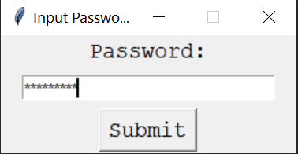
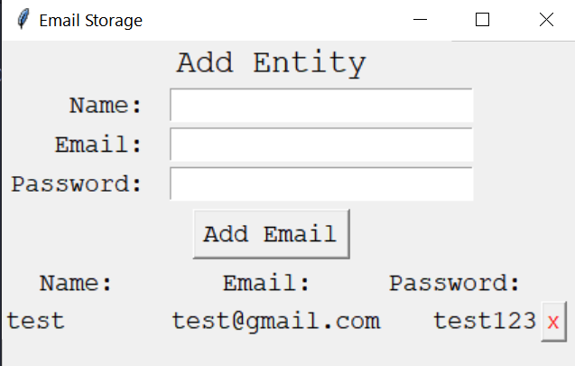

# Store You Email-IDs & passwords 

### You Can Add As many ID Passwords you wanted to add, it also provide secure system that it can login by the password provided by you. 

### Login Screen: 
Current Password is `Siddhant`

### Add/Remove Mail IDs & Passwords:

### It Will Save all the data at one Place in Encrypted form in a txt file in the same dir.

*If You Like it, Give this Repo. a ⭐*

